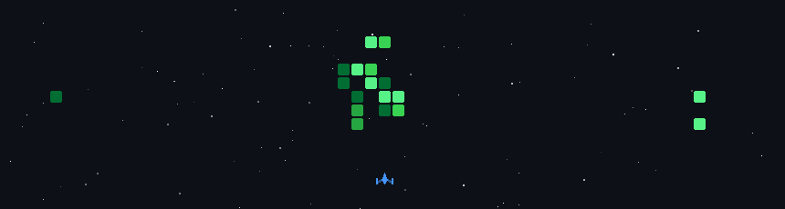

 

---

### 👨‍💻 About Me

- 🏗️ I build end-to-end web applications with modern JavaScript & Python stacks
- 🧠 Currently learning **Machine Learning** — regression, classification, neural networks
- ⚡ Working with **FastAPI** to build Python-powered backends and ML-ready APIs
- 🤖 Interested in how AI/ML integrates into real production systems
- 🔐 Passionate about secure system design, clean APIs, and scalable architecture
- 📍 Based in India · Open to internships & collaborations

---

### 🛠️ Tech Stack

  

---

### 🚀 Featured Projects

<table>
<tr>
<td width="50%" valign="top">

#### 🚗 EaseDrive — Car Rental Platform
> React · Vite · Node.js · Express.js · MongoDB · Tailwind

A full-stack car rental web app where users can browse vehicles, check real-time availability, and book rentals through a clean, responsive interface.

- 🔍 Search & filter with real-time availability
- 📱 Fully responsive UI with Tailwind CSS
- ⚙️ RESTful backend handling booking logic

🔗 **[Live Demo](https://car-rental-bay-three.vercel.app)** · **[GitHub](https://github.com/harshitdas85-glitch/CarRental)**

</td>
<td width="50%" valign="top">

#### 🔐 Auth System — Secure Backend
> Next.js · JWT · HTTP-only Cookies · REST API

A production-grade authentication backend built with security-first thinking.

- 🛡️ JWT access + refresh token mechanism
- 🍪 HTTP-only cookies to prevent XSS attacks
- 🔑 Crypto-hashed refresh tokens before storage

🔗 **[GitHub](https://github.com/harshitdas85-glitch/backend)**

</td>
</tr>
<tr>
<td width="50%" valign="top">

#### 🍹 Mojito — Mocktails Website
> React · Vite · JavaScript

A visually engaging mocktail showcase website with smooth UI and modern design.

🔗 **[Live Demo](https://mojito-site-nine.vercel.app)** · **[GitHub](https://github.com/harshitdas85-glitch/Mojito-site)**

</td>
<td width="50%" valign="top">

#### 🤖 GenAI Experiments
> Python · Local LLM · Hugging Face

Hands-on experiments with Generative AI — building and running language models locally, exploring prompt engineering and model integration.

🔗 **[GitHub](https://github.com/harshitdas85-glitch/genai)**

</td>
</tr>
</table>

---

### 📈 Currently Working On

- 📚 **ML Concepts** — supervised learning, model evaluation, feature engineering
- ⚡ **FastAPI** — building Python backends ready for ML model serving
- 🔭 Integrating trained models into production web applications
- 🧩 Open source contributions

---

### 🤝 Let's Connect

